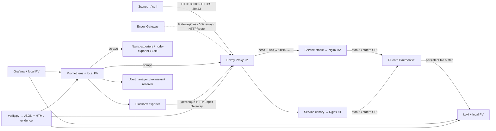

# SIGNAL
## Доказуемое DevOps-решение для MTC ENGINEER HACK

**Суть:** простой Nginx в Kubernetes, настоящий Gateway API, Prometheus и Fluentd → Loki. Вместо обещания «всё зелёное» — одна проверка, связывающая HTTP-запрос с метриками и найденным логом, и воспроизводимый эксперимент с отказом canary.

> **Статус поставки.** Полная приёмка пройдена на **Ubuntu 24.04.5 LTS / kubeadm 1.35.9**: [протокол Actions](https://github.com/GeKosGaming/signal-devops-mtc-engineer-hack/actions/runs/37145316744). Проверены выбранные контейнеры, HTTP/HTTPS Gateway, реальные targets/метрики, access/error-логи, NetworkPolicy, неизменный повторный deploy, отказ canary, все здоровые этапы canary и доставка логов после отказа Loki. Это лабораторный прогон одной VM. Итоговый архив для организатора - `Коннов.zip`; исходники находятся в публичном main.

## 1. Архитектура



Основной профиль: **одна выделенная Ubuntu-VM, kubeadm + containerd + Cilium**, без облачного LoadBalancer. Две реплики приложения/прокси переживают отдельное удаление Pod, но **не отказ единственного узла**. Контроллер Envoy устанавливается Helm; приложение и наблюдаемость — детерминированными Kubernetes JSON-манифестами, которые `kubectl` принимает непосредственно.

### Версии

| Компонент | Выбранная версия / способ |
|---|---|
| Ubuntu | 24.04 LTS, amd64; протестировано на Ubuntu 24.04.5 LTS / kubeadm VM |
| Kubernetes, kubeadm / kubelet / kubectl | 1.35.9; apt `1.35.9-1.1` |
| containerd / runc | Ubuntu containerd 1.x либо уже установленный containerd.io 1.x/2.x на выделенной VM; явные схемы CRI config v2/v3/v4, фактические версии в `.state/os-package-versions.txt` |
| Cilium | Helm chart 1.20.2, VXLAN, Kubernetes IPAM, kube-proxy сохранён |
| Helm | 3.20.2, бинарный SHA-256 фиксирован в `versions.env` |
| Envoy Gateway | Helm chart v1.9.2; совместимая ветка Envoy Proxy задаётся самим контроллером |
| Gateway API | v1.6.1, CRD из выбранного chart Envoy Gateway |
| Nginx / exporter | 1.30.5-alpine / 1.5.0 |
| Prometheus | 3.13.4 |
| Loki / образ Fluentd с Loki plugin | 3.7.8 / `grafana/fluent-plugin-loki:3.7.8` |
| Fluentd внутри этого образа | базовый upstream image `fluent/fluentd:v1.19-debian-1`; см. `docs/SOURCES.md` |
| Grafana | 13.1.0 |
| node-exporter / blackbox-exporter | 1.12.1 / 0.28.0 |
| Alertmanager / BusyBox | 0.34.1 / 1.37.0 |
| CI-профиль | kind 0.33.0, **Kubernetes 1.35.8**, конкретный digest в `versions.env` |
| Автоматизация | Bash, Make, Python 3.10+ (только стандартная библиотека), OpenSSL |

Все 10 образов приложения и наблюдаемости уже зафиксированы digest в `config/images.lock.json`; оба Helm chart сохранены в `vendor/` с проверенными SHA-256. `make lock` и `make vendor` нужны при осознанном обновлении зависимостей, после которого требуются новый commit и повторная приёмка. Образы, порождённые Cilium/Envoy, остаются под управлением закреплённых chart/controller; их фактические `imageID` попадают в отчёт. OS-пакеты, Helm OCI-источник до vendor, GitHub Actions `@v4` не объявляются побитово воспроизводимыми. Замена контейнеров на digest не подтверждает отсутствие уязвимостей.

## 2. Быстрый старт: основной kubeadm-профиль

Требуется **чистая выделенная Ubuntu 24.04 amd64 VM**, sudo, доступ в интернет к Ubuntu apt, `pkgs.k8s.io`, `dl.k8s.io`, `get.helm.sh`, GitHub, Docker Hub, Quay и `registry.k8s.io`. Расчётный комфортный размер: **4 vCPU, 8–12 GiB RAM, 40 GiB SSD**; это инженерная оценка, не опубликованный нагрузочный замер. Скрипт откажется при менее 2 vCPU / примерно 6 GiB RAM. IP узла должен быть стабильным.

Не запускать bootstrap на рабочем ПК/сервере с чужим кластером. Он отключает swap, изменяет sysctl, настраивает containerd и устанавливает Kubernetes. Он **не запускает `kubeadm reset`** и не пытается молча исправить чужую установку. Для данного стенда допустима выделенная VM; WSL и Windows-host не являются подтверждением Ubuntu kubeadm-профиля.

Из корня распакованного/клонированного репозитория:

```bash
git clone https://github.com/GeKosGaming/signal-devops-mtc-engineer-hack.git
cd signal-devops-mtc-engineer-hack
sudo bash scripts/bootstrap-ubuntu.sh --dedicated-node
make deploy
make verify
make acceptance
```

`make lock` и `make vendor` требуют доступности публичных upstream-источников. Ошибка скачивания/несуществующий тег останавливает процесс, а не заменяется `latest`. Для первичной диагностики допустим `make deploy` без lock/vendor; **финальную сдачу так не собирать**. Docker для kubeadm-развёртывания не требуется. Docker нужен только альтернативному kind-профилю и проверке конфигураций контейнерами.

Если у VM несколько сетевых интерфейсов, явно задать адрес:

```bash
sudo NODE_IP=192.168.56.10 bash scripts/bootstrap-ubuntu.sh --dedicated-node
```

Это пример адреса; использовать реальный доступный IP своей VM. Команды после bootstrap выполнять обычным пользователем. Kubeconfig находится в `.state/kubeconfig`, а не заменяет пользовательский `~/.kube/config`. Для ручного `kubectl`:

```bash
export PATH="$PWD/.tools:$PATH"
export KUBECONFIG="$PWD/.state/kubeconfig"
```

`make deploy` ждёт Storage Job, CRD, rollout и `Gateway Programmed`, делает server-side dry-run. **Успех deploy не равен успеху задания**: верификация отдельно проверяет путь запроса, targets и собранные логи.

### Сетевой доступ

NodePort: HTTP `30080`, HTTPS `30443`. Разрешить к ним доступ только проверяющим/своей LAN; SSH и Kubernetes API — только администратору. Не открывать в интернет Prometheus, Loki, Alertmanager или порт метрик. Скрипт не переписывает существующий firewall: конфликтующие UFW/firewalld правила требуется устранить на выделенной VM до запуска. При многонодовом развитии понадобятся также межузловые порты Kubernetes/Cilium — это не часть одиночного профиля.

## 3. Проверка приложения и Gateway API

```bash
IP=$(cat .state/node-ip)
curl --fail -i -H 'Host: signal.local' "http://$IP:30080/"
curl --fail -i -H 'Host: signal.local' "http://$IP:30080/canary"
curl --fail -i -H 'Host: signal.local' -H 'X-Release: canary' "http://$IP:30080/"
curl --fail --cacert .state/tls/ca.crt \
  --resolve "signal.local:30443:$IP" https://signal.local:30443/
```

Ожидается `Hello World!` с переводом строки, HTTP 200; заголовок `X-Release` показывает `stable` или `canary`. TLS проверяется с настоящим SNI `signal.local` и локальным CA, **без `-k`**. Чужой hostname получает 404. HTTP разрешён отдельно для демонстрации; принудительного redirect HTTP→HTTPS нет.

Ресурсы: `GatewayClass/signal`, `Gateway/signal`, `HTTPRoute/web-main`, `HTTPRoute/web-preview`, `EnvoyProxy/signal`. Последний — расширение реализации, а пользовательский путь всё равно проходит через стандартный Gateway API. `Service/signal-gateway` создаётся контроллером в `envoy-gateway-system`; ручной Ingress не используется.

```bash
kubectl get gatewayclass signal -o yaml
kubectl -n signal get gateway,httproute
make verify
```

Верификатор проверяет `Accepted`, `Programmed`, `ResolvedRefs` **с текущим `observedGeneration`**, HTTP/TLS, оба backend и отрицательный hostname. Внутренний port-forward указывает на **Service прокси Envoy**, не на Nginx. Дополнительно проверяется реальный NodePort. Адрес внешней проверки берётся из локального профиля и NodePort; произвольная подмена URL не допускается. HTTPS дополнительно проверяется через внешний NodePort с правильным CA/SNI.

## 4. Мониторинг

```bash
make ui
```

Порты привязываются только к `127.0.0.1`: Grafana `3000`, Prometheus `9090`, Loki `3100`, Alertmanager `9093`. Не публикуйте эти forwards на `0.0.0.0`. На удалённой VM использовать SSH local forwarding. В отдельном терминале получить **сгенерированный** пароль Grafana:

```bash
export KUBECONFIG="$PWD/.state/kubeconfig"
kubectl -n signal-observe get secret grafana-admin \
  -o jsonpath='{.data.password}' | base64 -d; printf '\n'
```

Логин `admin`. Пароль не включать в Git, отчёты или скриншоты. Дашборд `SIGNAL / Evidence before confidence` создаётся автоматически вместе с источниками Prometheus и Loki.

Обязательные jobs: `prometheus`, `nginx` (3 Pod), `envoy` (2 proxy Pod), `node`, `loki`, `gateway-probe`. Контроллер Envoy тоже использует порт 19001, но намеренно исключён из proxy-job по label владельца Gateway: у него другой endpoint.

```bash
curl --fail -sG http://127.0.0.1:9090/api/v1/query \
  --data-urlencode 'query=up{job=~"nginx|envoy|node|loki"}'
curl --fail -sG http://127.0.0.1:9090/api/v1/query \
  --data-urlencode 'query=sum(nginx_http_requests_total)'
curl --fail -sG http://127.0.0.1:9090/api/v1/query \
  --data-urlencode 'query=probe_success{job="gateway-probe"}'
```

Метрики: запросы/соединения Nginx, upstream latency Envoy, CPU/RAM/файловая система узла, готовность targets и синтетическая доступность через Gateway. HTTP-коды дополнительно считаются из access-логов в Loki. Nginx `stub_status` считает и служебные запросы exporter/health checks, поэтому график нельзя объявлять чистым пользовательским RPS. `verify` проверяет прирост счётчика после 40 запросов, непустые конечные значения, свежесть scrape ≤60 секунд и успешный blackbox probe.

Alertmanager хранит/показывает alerts локально. Настроен **пустой локальный receiver**, а не реальные внешние уведомления. Правила: Gateway unavailable, Loki target down, low disk, missing probe, отсутствие node-exporter и недостаточная численность healthy Nginx stable/canary или Envoy. Capacity-правила используют двухминутную задержку и не считают кратковременный rolling surge отказом. Внешний webhook/email настраивается отдельно, секретов в репозитории нет.

## 5. Логирование и доказательство конкретного запроса

Fluentd читает только `/var/log/containers/*_signal_nginx-*.log`: access-JSON из stdout и штатный error-текст Nginx из stderr. Весь `/var/log` монтируется read-only, чтобы работали symlink на `/var/log/pods`; позиции и ограниченный файловый буфер находятся в `/var/lib/signal-fluentd`. Назначение — локальный Loki, затем Grafana Explore / LogQL.

```bash
PROOF="manual-$(date +%s)"
IP=$(cat .state/node-ip)
curl --fail -H 'Host: signal.local' -H "X-Proof-ID: $PROOF" "http://$IP:30080/"
curl --fail -sG http://127.0.0.1:3100/loki/api/v1/query_range \
  --data-urlencode "query={namespace=\"signal\",app=\"web\",stream=\"stdout\"} | json | proof_id=\"$PROOF\"" \
  --data-urlencode 'since=10m' --data-urlencode 'limit=20'
```

Появление лога асинхронно; при ручной проверке повторить query после flush. `make verify` сам ждёт до 150 секунд и завершает проверку ошибкой, если совпадения нет. Он дополнительно запрашивает `/missing/<уникальный-ID>`, требует 404 и находит этот ID в **собранном stderr**, не просто в `kubectl logs`.

Loki labels ограничены `project`, `namespace`, `app`, `pod`, `stream`. `proof_id`, URI, request_id остаются полями, а не высококардинальными labels. Access-лог не включает IP, cookies, authorization или query string. **Штатный error-лог Nginx может содержать IP и URI**; демо использовать только с синтетическим трафиком. `X-Proof-ID` ограничен безопасными символами и длиной, но не служит аутентификацией или подписью.

## 6. Доказательства и демонстрация отказа

| Команда | Что действительно проверяет / делает |
|---|---|
| `make static` | локальные unit/static tests, `nginx -t` и настоящий HTTP при наличии локального nginx; результат и пропуски записываются |
| `make validate-containers` | конфиги в выбранных образах: Nginx, promtool, Loki, Fluentd, amtool; требует Docker |
| `make verify` | полный runtime-путь, политики сети, HTTP/TLS, маршруты, метрики, access/error-логи |
| `make demo` | 90/10 на 400 запросах, HTTP 503 у canary при зелёном `/healthz`, отказ в продвижении, откат, восстановление конфигурации, удаление одного stable Pod и измерение восстановления |
| `make canary` | здоровая canary 10→25→50→100%; при провале gate — попытка отката с проверкой настоящего HTTP |
| `make acceptance` | настоящий локальный Ubuntu 24.04 + kubeadm 1.35.9; deploy дважды, verify до/после, неизменность UID Pod/PVC/Storage Job и публичных TLS-сертификатов |
| `make log-delivery` | короткое отключение Loki, запросы с уникальными ID, восстановление, измеренные задержки/пропуски/дубли |
| `make operation-check` | на отдельном Linux-стенде: отказ конкурирующих deploy/canary/log-delivery/acceptance до изменений; настоящий SIGTERM после faulty canary и SIGINT группе процессов здорового продвижения; FAIL прерванной операции, восстановленный HTTP baseline и освобождённый lock |

`make demo` **намеренно меняет только демонстрационную canary и удаляет один Pod приложения**. `make log-delivery` временно останавливает Loki. Выполнять эти сценарии только на выделенном стенде. Полученные до завершения операции `SIGINT` / `SIGTERM` переводят прерванный сценарий в восстановление и не превращают его в PASS: при доступном API скрипт пытается вернуть baseline и проверяет фактическое состояние. При ошибке восстановления остаётся recovery marker; порядок ручного восстановления — `docs/RUNBOOK.md`.

### Координация операций и прерывания

Bootstrap, kind/deploy, canary/demo, log-delivery и acceptance используют общий Linux `flock` на `.state/workflow.lock`. Конкурирующая операция завершается сразу с сообщением `Another SIGNAL operation is running.`. Вложенный acceptance → deploy использует уже удерживаемый lock, а проверка унаследованного дескриптора подтверждает тот же файл и реальный kernel lock. Одна переменная окружения не даёт обхода блокировки. Lock удерживается до восстановления и записи отчёта.

Область координации — одна рабочая копия на одном хосте. Прямой `kubectl`, другое checkout и действия внешних контроллеров этой блокировкой не координируются. Не удалять lock-файл для «снятия» занятого lock: сначала дождаться завершения владельца. Наличие файла само по себе не означает, что операция ещё работает.

`SIGINT` / `SIGTERM` позволяют выполнить обработчик, но успешность восстановления зависит от API, фактического объекта и времени выполнения. `SIGKILL`, потеря VM и недоступность API не обеспечивают автоматический rollback. Recovery marker сохраняет данные для диагностики, а не выполняет восстановление самостоятельно. `.state/canary-restore.json` блокирует новые canary-операции до ручного восстановления здоровой canary и stable 100%; `.state/log-delivery-restore.json` хранит исходные UID и число реплик Loki. Удалять marker только после проверенного восстановления по `docs/RUNBOOK.md`.

Для canary граница завершения наступает после обработки marker, необходимого восстановления и финальной записи отчёта, пока port-forward ещё открыты. Сигнал до этой границы, включая удаление marker или запись отчёта, требует восстановления и итогового FAIL. Повторные SIGINT/SIGTERM во время bounded cleanup записываются, но не прерывают его. Сигнал уже после завершения, при закрытии port-forward, только печатает сообщение: ранее завершённое успешное продвижение сохраняет 100% canary и свой PASS.

`make operation-check` создаёт `evidence/operations/report.json`: он проверяет настоящие конкурирующие процессы и оба canary-прерывания на работающем Kubernetes. SIGINT направляется группе процесса оператора, SIGTERM — его PID; внешние команды запускаются в отдельных process sessions. Нужны доступный API, baseline stable 100% и отсутствие неразобранных markers. Прерванные дочерние сценарии обязаны сохранить FAIL, тогда как safety-протокол получает PASS только после проверки их восстановления. Сигналы Loki и отказ API этим протоколом не проверяются. Финальная упаковка требует успешный operations report того же чистого HEAD, что и Ubuntu acceptance; unit/process-тесты отдельно не заменяют этот отчёт.

Gate проверяет каждый этап 10/25/50% выборкой из 200 запросов к основному маршруту (допуск четыре стандартных отклонения), а финальные 100% - 40 запросами. Дополнительно использует 30 запросов к **выделенному canary-пути**, проверяет ответ/версию, долю ошибок ≤1%, p95 ≤500 ms, не менее 20 samples и свежий scrape именно текущего canary Pod, выполненный после завершения когорты. При 30 samples этот порог допускает только 0 ошибок. 500 ms — демонстрационный бюджет, не заявленный пользовательский SLO. Это CLI-эксперимент, не непрерывный промышленный rollout-controller; он не заменяет Argo Rollouts/Flagger. После успешного `make canary` основной маршрут остаётся 100% canary; `make deploy` возвращает baseline 100% stable.

Каждая проверка пишет `report.json` и автономный `report.html` в `evidence/runtime/`, `evidence/demo/`, `evidence/canary/`, `evidence/log-delivery/`, `evidence/operations/`, `evidence/acceptance/`. Содержатся реальные responses, PromQL/LogQL результаты, длительности, версия/образ, commit и ОС. Пустые метрики/логи и устаревшие conditions не считаются PASS. Факт успешного локального теста не преобразуется в факт успешного Kubernetes теста.

## 7. Надёжность и безопасность

Nginx работает без root, с read-only rootfs, `drop ALL`, seccomp, probes, requests/limits, graceful stop и PDB. В прикладном namespace — default deny ingress/egress; приложение доступно по 8080 только от своего Gateway, по 9113 только от Prometheus. `verify` запускает ограниченный Job из другого namespace: доступ через Gateway должен работать, прямой доступ к Service приложения — нет. Такой тест проверяет исполнение политики Cilium, а не просто наличие YAML.

Prometheus имеет только `get/list/watch pods` в трёх конкретных namespaces через RoleBinding. Никакого чтения Secrets / nodes proxy / cluster-admin для мониторинга. Runtime-скрипты требуют admin kubeconfig для развёртывания и tests; это отдельная операторская привилегия. Исключения PSA нужны Fluentd (root + host logs) и node-exporter/storage Job (host mounts); они вынесены в системные namespaces. Root у Fluentd не равен privileged container, но доступ к журналам хоста остаётся чувствительной привилегией.

Loki/Prometheus/Grafana/Alertmanager используют local PV, `Retain`; пересоздание Pod не стирает данные. Retention логов/метрик 24 h, Prometheus также ограничен 3 GB, Fluentd buffer 256 MiB. Указанная ёмкость local PV — **не жёсткая файловая квота**. Следить за реальным диском. При удалении PVC Retain не означает автоматическое повторное присоединение: требуется осознанное восстановление привязки, см. runbook.

Секреты создаются при первом запуске, повторно не генерируются. Локальный TLS leaf действителен 90 дней; до истечения остаётся менее 7 дней — deploy откажется и потребует осознанного обслуживания, а не молча поменяет доверие. Автоматическое продление сертификатов не реализовано.

## 8. CI и альтернативный kind

```bash
# Linux amd64 с уже работающим Docker, curl, Python, Make, OpenSSL
make kind
make deploy
make verify
make demo
```

kind использует тот же Cilium и политики, но другой явно указанный Kubernetes patch — 1.35.8 из digest-pinned upstream node image. HTTP опубликован на `127.0.0.1:8080`, HTTPS — `127.0.0.1:8443`; в ручных curl заменить порты 30080/30443. Такой прогон **не заменяет** приоритетный kubeadm acceptance.

`.github/workflows/ci.yml` выполняет static → image config validation → kind deploy/redeploy → operation-check → отказ canary → здоровая canary и возврат deploy → отказ Loki → verification → artifacts. Полный [kind CI](https://github.com/GeKosGaming/signal-devops-mtc-engineer-hack/actions/runs/37145307254) прошёл, включая общую блокировку и оба canary-прерывания. Только hosted ephemeral Ubuntu runner, read-only permissions, без `pull_request_target`, deployment secrets и production доступа. Kubernetes dry-run выполняется на настоящем API после установки CRD.

## 9. Структура и дальнейшие документы

```
config/           Nginx, Fluentd, Prometheus rules, Loki, Grafana source and image versions
infra/            kubeadm helpers, Helm values, kind networking
scripts/          bootstrap, deterministic render, verify, canary, acceptance, packaging
manifests/        committed generated snapshots for review; source of truth: config + render.py
tests/            structural, fail-closed and local nginx integration tests
evidence/         actual local result; runtime reports ignored until deliberately published
docs/             architecture decisions, runbook, demo, submission, source references, passport
.github/          pipeline definition
```

`docs/DECISIONS.md` — анализ кейса и решения; `docs/REQUIREMENTS.md` — матрица соответствия; `docs/RUNBOOK.md` — диагностика; `docs/DEMO.md` — защита; `docs/SUBMISSION.md` — реальный порядок сдачи; `docs/SOURCES.md` — официальные технические источники. MIT относится к нашему коду; сторонние компоненты сохраняют свои лицензии.

## 10. Известные ограничения

Один узел и локальный диск — единые точки отказа, нет multi-AZ, replicated storage, disaster-recovery или zero-downtime гарантии. Сбор логов имеет буфер и повторы, но не exactly-once; возможны дубли и потери при заполнении диска, долгой недоступности Loki, ротации исходных файлов или потере узла. CRI partial/multiline не склеиваются: конфигурация рассчитана на короткие демонстрационные access/error-записи.

Нет service mesh, end-to-end mTLS, rate limiting, WAF, cert-manager, HPA, OpenTelemetry tracing, GitOps-контроллера, долгосрочного SLO/error-budget анализа или оплаченных сервисов. Эти возможности не выдаются за реализованные. Метрики node-exporter CPU/RAM читают host `/proc`; сетевые collectors без hostNetwork могут отражать namespace контейнера. Grafana/наблюдаемость single-replica и могут кратко недоступны при обновлении.

Первичная установка зависит от публичных пакетов/образов и сетевого доступа; это не air-gapped поставка. ARM64, другой дистрибутив, миграция существующего Kubernetes и автоматическое обновление версии не заявлены. Итоговую работоспособность доказывает только настоящий успешный отчёт на выбранной целевой машине.

## Автоматическая приёмка на Ubuntu VM

В Actions доступен `Ubuntu kubeadm acceptance` (ручной запуск). Он проверяет выбранные контейнеры настоящими инструментами, создаёт kubeadm-кластер на отдельной Ubuntu 24.04 VM, выполняет acceptance, operation-check, отказ canary, восстановление Pod, короткий отказ Loki и финальный acceptance. Это отдельная проверка от kind CI. Отчёты публикуются как artifact, с привязкой к точному commit. Ошибка любого шага завершает workflow неуспешно.

### Измеренный протокол

90/10: stable 360, canary 40 из 400. Восстановление Pod: 6.58 с, ошибок 0/50. После недоступности Loki найдено 20/20 ID; максимальная наблюдённая задержка 39.9 с; дополнительных видимых копий 0. Все этапы здоровой canary 10/25/50/100% прошли. Это измерения одного лабораторного прогона.

Реальные SIGTERM после инъекции отказа и SIGINT группе процесса во время здорового продвижения восстановили stable100 и здоровую canary; намеренно прерванные процессы сохранили FAIL, убрали recovery marker и освободили lock. Четыре конкурирующие команды отклонены без изменения конфигурации.

Исходный подтверждённый commit: `f99de235d92b8909b59827021f41d97178e8d07b`. Отчёты доступны в [Ubuntu Actions](https://github.com/GeKosGaming/signal-devops-mtc-engineer-hack/actions/runs/37145316744), [kind CI](https://github.com/GeKosGaming/signal-devops-mtc-engineer-hack/actions/runs/37145307254) и `evidence/published/`. После финализации документов приёмка повторяется для финального HEAD перед упаковкой. Конкретный commit и чистота рабочей копии всегда записаны в свежем `evidence/acceptance/report.json`.
